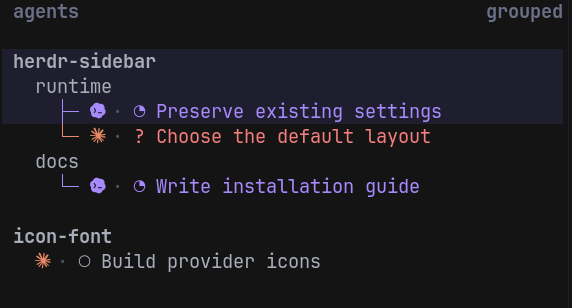

# Herdr Sidebar Config

**See what each agent is doing, grouped by workspace and tab.**

A [Herdr](https://herdr.dev) sidebar preset: **workspace → tab → agent**, with
readable task labels and provider icons. Single-tab workspaces stay compact;
multiple tabs get a tree. Includes the configuration, icon font, and companion
plugin that keeps the rows current. No Herdr fork or font build required.



*Actual Herdr 0.8.2 rendering in Ghostty 1.3.1. Agent names, tasks, and states are
demonstration data in a separate session; the plugin and renderer are real.*

## Install

Requires **Herdr 0.8.2 or later**, [uv](https://docs.astral.sh/uv/), and Git. uv
provisions the required Python 3.12 runtime. Compatibility with Herdr 0.9.0 has
been verified with its released macOS binary. The icon setup targets Ghostty on
Linux or macOS. Linux/Ghostty has been tested live; macOS paths are provided but
have not been tested in a live terminal.

Run inside a Herdr terminal pane:

```sh
git clone git@github.com:iancleary/herdr-sidebar-config.git ~/Code/herdr-sidebar-config
cd ~/Code/herdr-sidebar-config
uv sync
.venv/bin/python setup_sidebar.py install
.venv/bin/python setup_sidebar.py doctor
```

This automatic path requires writable Herdr and terminal configuration files.
If a configuration manager owns either file, do not run the installer against
its generated files or symlinks. Add the sidebar settings, icon font, and
terminal mapping to the manager's source instead, then link and enable the
plugin. Follow the complete [managed-configuration integration](docs/setup.md#managed-configuration-integration)
checklist.

`uv sync` installs the pinned Python runtime in `.venv`. Herdr hooks call that
interpreter directly, rather than the macOS system Python.

Open a **fresh Ghostty process** to load the newly installed font. Your Herdr
session keeps running; attach to it from that process. A new tab in an existing
Ghostty process may still use its old font cache.

Want to inspect the changes first? Run `.venv/bin/python setup_sidebar.py install --dry-run`.
For another terminal, run `.venv/bin/python setup_sidebar.py install --text` to use short
provider labels such as `AI` and `C`, with no font or Ghostty changes.

Setup links this checkout as a plugin, replaces the agent sidebar layout, sets
workspace sorting, and backs up modified files. It preserves other Herdr
settings. Keep the checkout where you installed it. See [setup details](docs/setup.md)
for custom paths, manual installation, and troubleshooting.

Herdr 0.9 can combine agents from local and saved SSH machines in one sidebar.
Install and enable this plugin on every machine that hosts those agent panes so
each server can publish its display tokens. Install the layout, font, and
terminal mapping on every computer that displays the Herdr client. See
[multi-machine setup](docs/setup.md#herdr-09-multi-machine-setup) for the split
between agent hosts and viewing clients.

## What changes

- **One tab:** agents sit directly beneath their workspace name.
- **Multiple tabs:** each tab with agents gets a plain heading, with agent
  branches below it. Shell-only tabs count toward the rule but add no empty rows.
- **Readable labels:** working Codex and Claude panes use their latest meaningful
  local instruction; terminal, tab, and agent names remain fallbacks. No model
  call or generated summary is involved.
- **Native state:** `◔` working, `?` blocked, `✓` completed, `○` idle, `·` unknown.
  These are static symbols, not animated loaders.
- **Provider icons:** Claude, Codex, OpenCode, OMP, Cline, Mastra Code, Kimi,
  Kilo, and Maki. Other agents get a diamond fallback.

The tree is a visual grouping; it does not add collapsible folders. Agent clicks
and keyboard navigation remain Herdr's native behavior. Long labels are clipped
to the sidebar width. Session history reads are local, bounded, and performed
only during existing refresh events.

## Refresh, update, or remove

Normal lifecycle events refresh the sidebar automatically. After manually
changing a title override or icon setting:

```sh
herdr plugin action invoke refresh --plugin iancleary.herdr-sidebar
```

To update, run `git pull --ff-only` in this checkout, then repeat the install and
doctor commands. Setup refuses to overwrite files edited after installation;
use the [manual steps](docs/setup.md) when keeping later customizations.

To restore the files saved during setup:

```sh
.venv/bin/python setup_sidebar.py uninstall --dry-run
.venv/bin/python setup_sidebar.py uninstall
```

Removal clears generated tokens, disables the plugin, and restores its backups.
It keeps the checkout and disabled registration. If any managed file changed
since setup, removal stops before writing; [manual removal](docs/setup.md#manual-removal)
explains how to keep those edits.

## For agents and contributors

Start with [AGENTS.md](AGENTS.md). It contains the installation workflow, file
map, behavior contracts, and verification commands. All setup commands accept
`--json`; install and uninstall also accept `--dry-run`.

The runtime uses only Python's standard library. It reads a local Herdr snapshot,
optionally reads a bounded tail of matching Codex or Claude history, and publishes
changed display tokens. There is no polling loop, telemetry, network service, or
API key. [Architecture](docs/architecture.md) documents the data flow, token names,
icon settings, and development checks.

Maintainers should use the checked-in deterministic [release process](docs/release.md).

## Credits and license

Adapted from [moneycaringcoder/herdr-agent-icons](https://github.com/moneycaringcoder/herdr-agent-icons),
with a borderless Codex mark derived from
[qintmb/herdr-icon-agent-ui](https://github.com/qintmb/herdr-icon-agent-ui).

Code is [MIT licensed](LICENSE). Provider artwork keeps its original terms and
trademarks; see [third-party notices](assets/THIRD_PARTY_NOTICES.md). This is an
independent community plugin, not an official Herdr or provider product.
